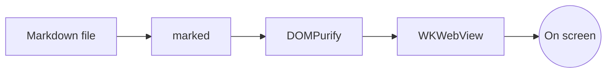

This file doubles as a rendering test — if everything below looks right, the app
works.

## Text

Regular paragraph with **bold**, *italic*, ***both***, ~~struck out~~, `inline code`,
a [link to an external site](https://daringfireball.net/projects/markdown/), and a
[link to another local file](./README.md) that opens inside the app.

> A blockquote to check the rule and the muted colour.
> It runs across two lines.

Bare URLs autolink: https://github.com and www.example.com.

## Alerts

> [!NOTE]
> Useful information a reader should know.

> [!TIP]
> A helpful suggestion.

> [!IMPORTANT]
> Something needed to achieve the goal.

> [!WARNING]
> Needs immediate attention.

> [!CAUTION]
> Risk of a bad outcome.

## Footnotes

Markdown has a footnote syntax[^syntax], and GitHub renders it[^github].

[^syntax]: The reference goes inline, the text goes at the bottom.
[^github]: marked needs a plugin for this — it isn't in the base GFM flag.

---

## Lists

- First item
- Second item with a nested list
  - Nested one
  - Nested two
    - Third level
- Third item

1. Ordered one
2. Ordered two
3. Ordered three

- [x] A finished task
- [ ] An unfinished task

## Table

| Metric | Q1 | Q2 | Change |
| --- | --: | --: | --: |
| Revenue | 1,240 | 1,730 | +39.5% |
| Active users | 8,412 | 9,006 | +7.1% |
| Churn | 2.1% | 1.8% | -0.3pp |

## Code

Inline `swift build` and a fenced block:

```swift
struct Viewer: View {
    let document: Document

    var body: some View {
        Text(document.title)
            .font(.title)
    }
}
```

```bash
./build.sh && open build/MDView.app
```

```python
def slugify(text: str) -> str:
    return "-".join(text.lower().split())
```

## Tree

```text
Slack @mention
    │
    ├── verify and deduplicate
    └── background routing
            │
            ├── Redis per-thread lock
            └── shared sidecar event stream
```

## Diagram



## Image


## Collapsible

<details>
<summary>Click to expand</summary>

Hidden content with a `code span` inside.

</details>

## Sanitiser check

The next two lines must render as inert text, not run:

<script>window.__pwned = true;</script>


Press <kbd>⌘</kbd><kbd>F</kbd> to search this document.
